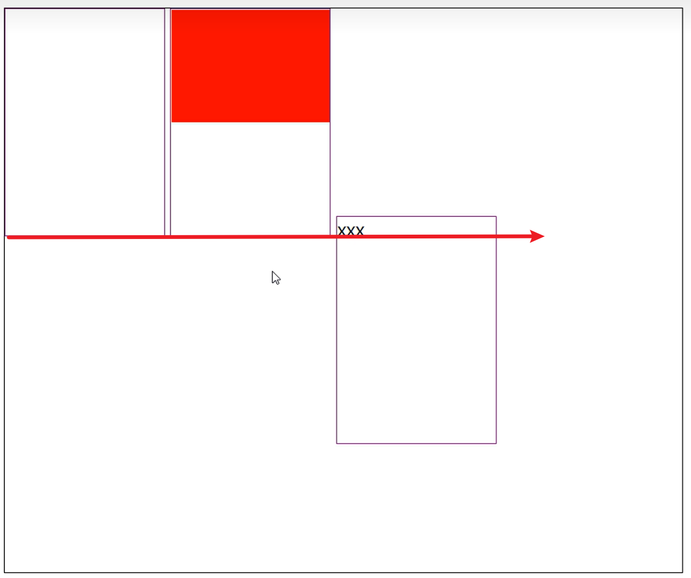
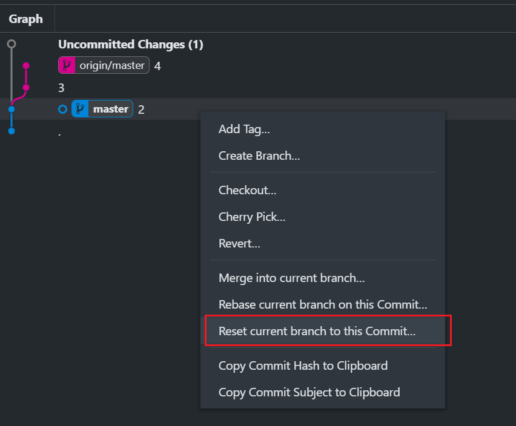
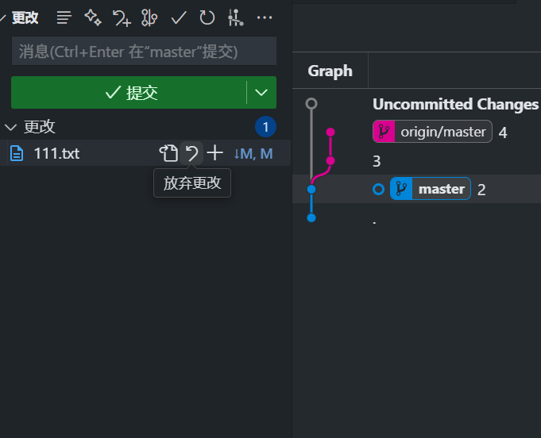
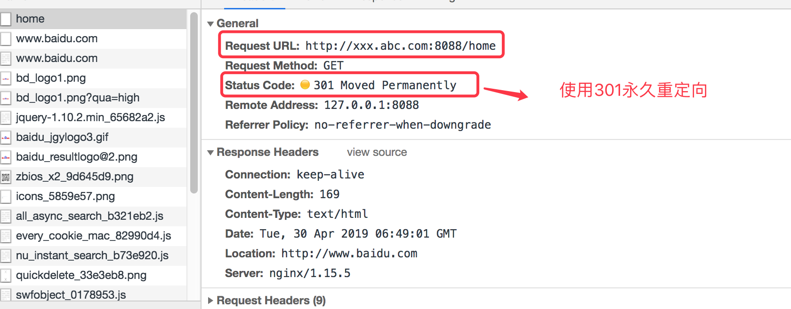
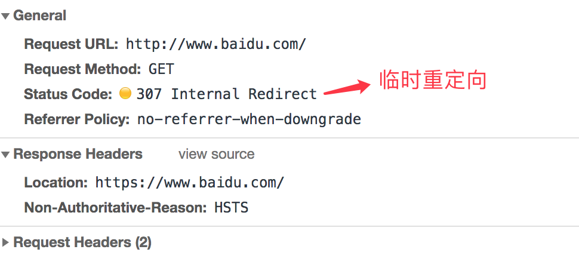
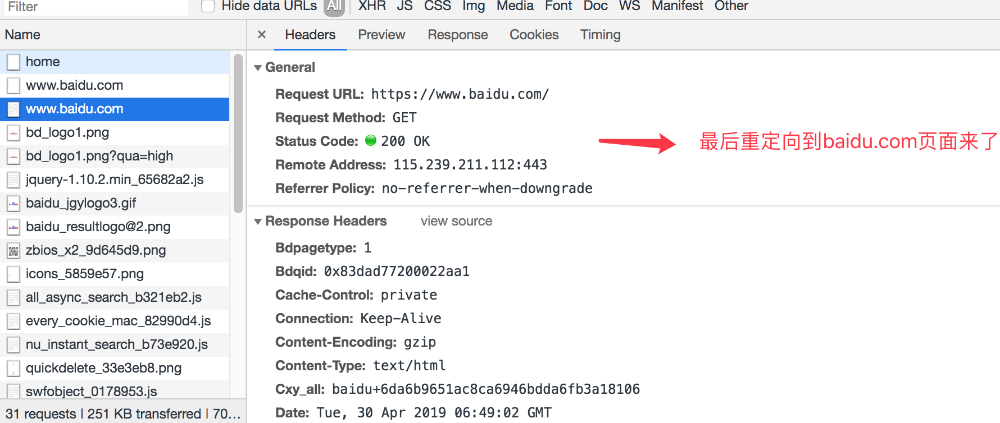

## CSS基本操作

### vertical-align



当上图中三个div内部没有文字的时候是顶部对齐的，当第三个div内部存在文字就会让自己位置下降，原因是默认div的`vertical-align:baseline`，三个div的baseline必须在一条线上，前两个div内部不存在内联元素或者`overflow:visible`则baseline位于自己的margin底边缘

如果div设置`vertical-align:middle`，那么它的位置应该在元素parent的基线网上文字的1/2位置

内部div的parent的baseline根据内部最后一个子元素的基线确认的，所以也可以通过伪元素修改

```css
.parent:after{
    content:"";
    display:inline-block;
    height:100%;
    font-size:0;
    vertical-align:middle;
}
```


## Git基础操作

### 代理错误 443

错误信息`Failed to connect to github.com port 443`，有时候需要通过代理去下载github等资源

查看代理命令

```
git config --global --get http.proxy
git config --global --get https.proxy
```

设置代理命令

```
#http
git config --global http.proxy 127.0.0.1:7890
git config --local http.proxy 127.0.0.1:7890

git config --global https.proxy 127.0.0.1:7890
git config --local https.proxy 127.0.0.1:7890
```

取消代理命令

```
git config --global --unset http.proxy
git config --local --unset http.proxy

git config --global --unset https.proxy
git config --local --unset https.proxy
```

 `--local`是只对本地仓库配置进行修改 

一般socks5在clash工具中的设置中查看

### Reset 回退操作

Reset操作一定需要谨慎，个人认为应该先切一个分支出来以作备份

点击`Reset current branch to this commit`，选择默认mixed模式表示会取消commit和add两个操作



放弃文件暂存区的所有更改就能将本地所有操作都回退到会到之前



最后一步就是需要将本地回退之后的代码强推上去`git push -f`


## Nginx

### 301

```nginx
worker_processes  1;

events {
    worker_connections  1024;
}
http {
    include       mime.types;
    default_type  application/octet-stream;

    sendfile        on;
    #tcp_nopush     on;

    #keepalive_timeout  0;
    keepalive_timeout  65;

    #gzip  on;

    server {
      listen       8081;
      server_name  localhost;
      location / {
        root   html;
        index  index.html index.htm;  
      }
      error_page   500 502 503 504  /50x.html;
      location = /50x.html {
        root   html;
      }
    }
    server {
      listen 8088;
      server_name xxx.abc.com;
      location / {
        proxy_pass http://127.0.0.1:3001;
        rewrite ^/(.*) http://www.baidu.com permanent;
      }
    }
}
```

监听端口号是8088，然后server_name 配置设置为 xxx.abc.com， 然后当我们访问 http://xxx.abc.com:8088/的时候，会先反向代理到我们的http://127.0.0.1:3001下的node对应的页面上来，反向代理完成后，会使用 rewrite 重定向百度页面去了。如上配置完成后，我们需要重启下nginx服务器；使用命令

第一步：



第二步：



第三步：


